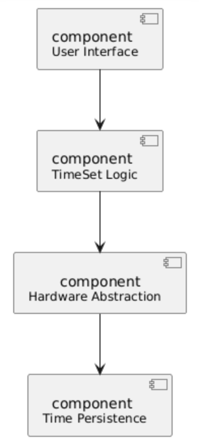

# Architektur
## Architektur festlegen

**Schichtenmodell**

- Jede Schicht kann nur in eine Richtung mit der Schicht direkt darunter kommunizieren.
- Jede Schicht kann unabhängig getestet und geändert werden.
- Die Gruppen sind nach funktionalen Rollen aufgeteilt oder getrennt.
- Es gibt keine Rücksprünge oder Querkommunikation.

## [Komponentdiagramm](../referenziert/Architecture/Komponentendiagramm2.png)

| Komponente         | Requirements (Kapitel-/Nr.)                 | Jira-Referenzen                                       |
|-------------------|---------------------------------------------|--------------------------------------------------------|
| User Interface     | 4.2, 4.3, 5.1, 5.2; NF 2.1, 2.2, 2.3, 4.1    | TIME-11, TIME-12, TIME-13, TIME-14; TIME-NF03,     TIME-NF04, TIME-NF05, TIME-NF08 |
| TimeSet Logic      | 1.1, 1.2, 1.3, 2.1, 2.2, 2.3, 2.4, 4.1       | TIME-01, TIME-02, TIME-03, TIME-04, TIME-05, TIME-06, TIME-07, TIME-10 |
| Device Abstraction | 4.3, 5.1, 5.2; NF 1.1, 1.2                  | TIME-12, TIME-13, TIME-14; TIME-NF01, TIME-NF02        |
| Time Persistence   | 3.1, 3.2; NF 3.1, 3.2                        | TIME-08, TIME-09; TIME-NF06, TIME-NF07                |

| Komponente         | Rolle                         | Verantwortlichkeiten                                                                                 |
|-------------------|-------------------------------|------------------------------------------------------------------------------------------------------|
| User Interface     | Präsentationsschicht          | Zeitdarstellung (12/24 h, AM/PM), aktives Feld 2 Hz blinken lassen, Helligkeit dimmen, Feedback anzeigen/auslösen. |
| TimeSet Logic      | Fach-/SteuerLogik               | Einstellmodus starten/beenden, Stunden/Minuten ±1 & Schnelllauf, 10-s Timeout, 12/24-Umschaltung, Speichern/Abbrechen orchestrieren. |
| Device Abstraction | Hardware-Interface            | Tasten lesen + Entprellung, Display ansteuern.               |
| Time Persistence   | Speicher-/Persistenzschicht   | Uhrzeit schreiben, persistente Sicherung (RTC), Datenintegrität bei Abbruch.       |

## Schnittstellendefinition

| Ziel             | Quelle              | Schnittstellen                                                           |
|------------------|---------------------|---------------------------------------------------------------------------|
| userInterface    | timeSetLogic        | updateView(mode, hour, minute), showSaved(), showTimeout()               |
| userInterface    | hardwareAbstraction | buttonInput(buttonId)                                                    |
| timeSetLogic     | hardwareAbstraction | readButtonState(), readRotary(), readConfirm()                           |
| timeSetLogic     | timePersistence     | loadTime(): TimeDTO, saveTime(TimeDTO dto)                               |
| hardwareAbstraction | timePersistence  | loadDisplayConfig()                                                      |

