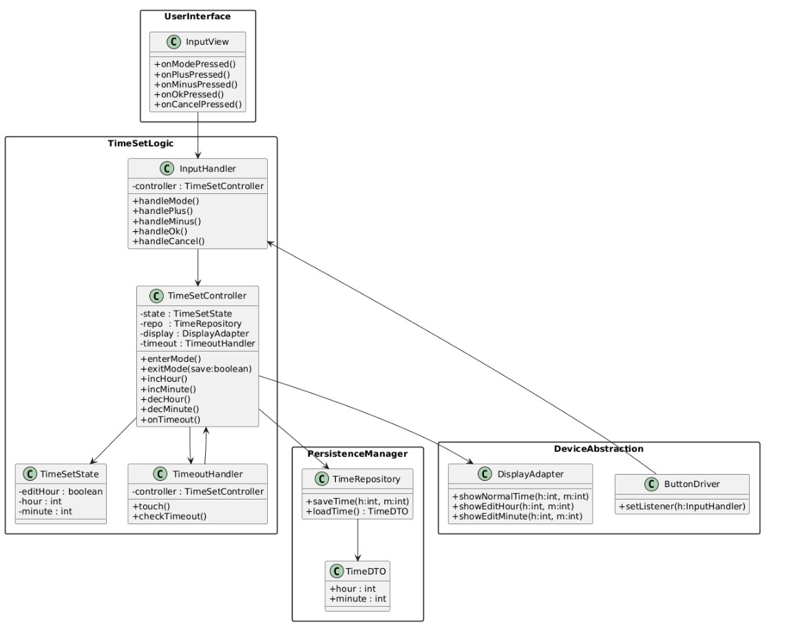
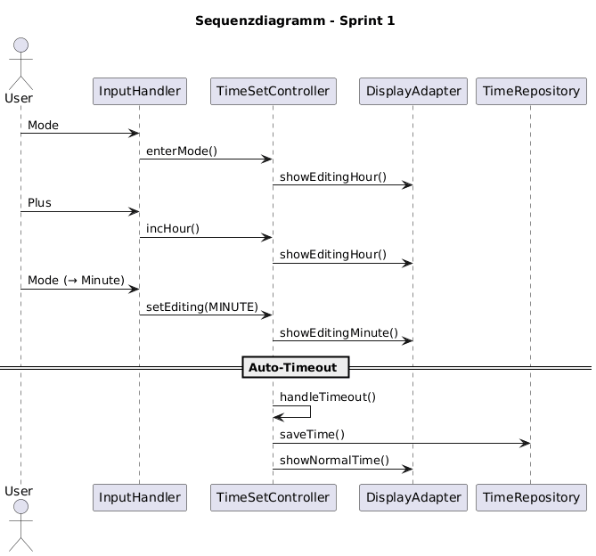
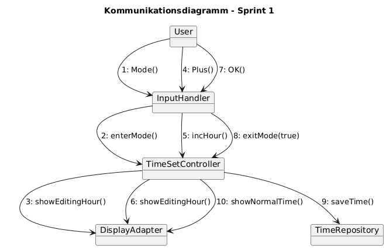

# Design – Sprint 1

## Klassendiagramm

Das Klassendiagramm wurde zunächst als erster Entwurf erstellt, um eine mögliche Struktur der Uhrzeiteinstellung festzuhalten. In diesem ersten Wurf standen vor allem die zentralen Klassen im Fokus: **InputView**, **InputHandler**, **TimeSetController**, **TimeSetState**, **DisplayAdapter** und **TimeRepository**. Im Verlauf der Verfeinerung haben sich weitere Hilfsklassen als sinnvoll erwiesen (z.B. **TimeoutHandler**), andere Strukturen wurden vereinfacht, damit der Ablauf für Sprint 1 klar abbildbar bleibt.

Das Diagramm zeigt alle für Sprint 1 relevanten Methoden und Attribute, damit die Interaktion zwischen UI (Button-Eingaben), Logik (Einstellmodus, Stunden/Minuten) und Persistenz (Speichern der Zeit) eindeutig erkennbar ist. Die Sichtbarkeit wurde – wie im Musterbeispiel – nicht für jede Hilfsklasse im Detail ausgeführt, weil der Schwerpunkt auf der Schichtenstruktur (UserInterface, TimeSetLogic, DeviceAbstraction, PersistenceManager) liegt.

Die folgende Abbildung zeigt den aktuellen Stand des Klassendiagramms für Sprint 1.

 

## 2. Sequenzdiagramm

Szenario: Benutzer betritt Einstellmodus, ändert Stunde, wechselt zu Minute, Timeout speichert.

## 3. Kommunikationsdiagramm

