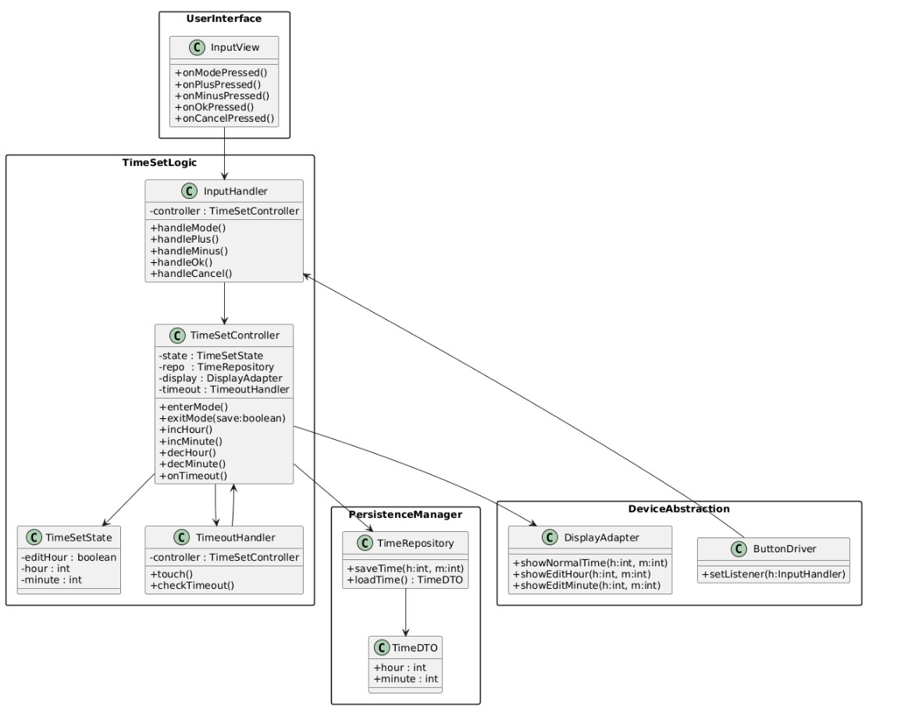

# Design – Sprint 1 (Wecker-Uhrzeiteinstellung)

## 1. Klassendiagramm

## 2. Sequenzdiagramm

Szenario: Benutzer betritt Einstellmodus, ändert Stunde, wechselt zu Minute, Timeout speichert.

## 3. Kommunikationsdiagramm

